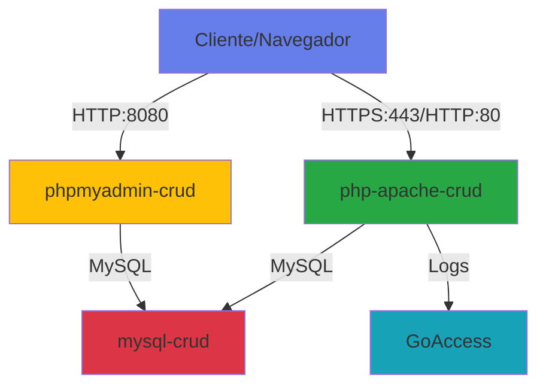

# 🚀 Sistema de Gestión de Empleados - CRUD PHP-MySQL con Docker

Sistema completo de gestión CRUD (Create, Read, Update, Delete) desarrollado con PHP y MySQL, implementado con Docker, Apache, SSL/HTTPS, mod_rewrite y análisis de logs con GoAccess.

## 📋 Tabla de Contenidos

- [Características](#características)
- [Tecnologías Utilizadas](#tecnologías-utilizadas)
- [Requisitos Previos](#requisitos-previos)
- [Instalación](#instalación)
- [Uso](#uso)
- [Arquitectura del Proyecto](#arquitectura-del-proyecto)
- [Características Técnicas Implementadas](#características-técnicas-implementadas)
- [Capturas de Pantalla](#capturas-de-pantalla)
- [Solución de Problemas](#solución-de-problemas)
- [Créditos](#créditos)

## ✨ Características

- ✅ **CRUD Completo**: Crear, leer, actualizar y eliminar empleados
- ✅ **Dockerizado**: Fácil despliegue y portabilidad
- ✅ **SSL/HTTPS**: Comunicaciones seguras con certificados autofirmados
- ✅ **mod_rewrite**: URLs limpias y amigables
- ✅ **GoAccess**: Análisis de logs en tiempo real
- ✅ **Diseño Responsive**: Bootstrap 5 con interfaz moderna
- ✅ **Base de Datos**: MySQL 8.0 con datos de ejemplo
- ✅ **phpMyAdmin**: Gestión visual de la base de datos
- ✅ **Seguridad**: Headers de seguridad, validación de datos, prepared statements

## 🛠 Tecnologías Utilizadas

### Backend
- **PHP 8.2**: Lenguaje de programación del lado del servidor
- **MySQL 8.0**: Sistema de gestión de bases de datos
- **Apache 2.4**: Servidor web con módulos SSL y Rewrite

### Frontend
- **HTML5 & CSS3**: Estructura y estilos
- **Bootstrap 5.3**: Framework CSS responsive
- **Bootstrap Icons**: Iconografía moderna

### DevOps
- **Docker**: Contenedorización de la aplicación
- **Docker Compose**: Orquestación de contenedores

### Herramientas
- **GoAccess**: Análisis de logs en tiempo real
- **phpMyAdmin**: Gestión visual de MySQL
- **OpenSSL**: Generación de certificados SSL

## 📦 Requisitos Previos

- **Docker**: versión 20.10 o superior
- **Docker Compose**: versión 2.0 o superior
- **Git**: Para clonar el repositorio
- **Navegador web moderno**: Chrome, Firefox, Safari o Edge

### Verificar instalación de Docker

```bash
docker --version
docker-compose --version
```

## 🚀 Instalación

### 1. Clonar el repositorio

```bash
cd /tmp
# El proyecto ya está en /tmp/php-crud-docker/
```

### 2. Estructura del proyecto

```
php-crud-docker/
├── docker-compose.yml          # Orquestación de contenedores
├── Dockerfile                  # Imagen personalizada de Apache+PHP
├── docker-entrypoint.sh        # Script de inicialización
├── init.sql                    # Script de inicialización de BD
├── .env.example                # Plantilla de variables de entorno
├── .gitignore                  # Archivos ignorados por Git
├── README.md                   # Esta documentación
│
├── apache-config/              # Configuración de Apache
│   ├── 000-default.conf        # VirtualHost HTTP (redirige a HTTPS)
│   └── default-ssl.conf        # VirtualHost HTTPS
│
├── src/                        # Código fuente de la aplicación
│   ├── index.php               # Página principal (listado)
│   ├── create.php              # Crear empleado
│   ├── read.php                # Ver detalles de empleado
│   ├── update.php              # Actualizar empleado
│   ├── delete.php              # Eliminar empleado
│   ├── config.php              # Configuración de BD
│   ├── error.php               # Página de error
│   ├── analytics.php           # Visor de estadísticas GoAccess
│   ├── .htaccess               # Reglas de mod_rewrite
│   └── goaccess/               # Reportes de GoAccess
│
├── ssl/                        # Certificados SSL (generados automáticamente)
└── logs/                       # Logs de Apache (persistentes)
```

### 3. Construir y ejecutar los contenedores

```bash
cd /tmp/php-crud-docker

# Construir y levantar los contenedores
docker-compose up -d --build
```

Este comando:
- Descarga las imágenes base necesarias
- Construye la imagen personalizada de Apache+PHP
- Genera certificados SSL autofirmados
- Crea los contenedores (web, db, phpmyadmin)
- Inicializa la base de datos con datos de ejemplo
- Inicia GoAccess para análisis de logs

### 4. Verificar que los contenedores están corriendo

```bash
docker-compose ps
```

Deberías ver 3 contenedores activos:
- `php-apache-crud` (Web server)
- `mysql-crud` (Base de datos)
- `phpmyadmin-crud` (Gestor visual de BD)

## 🎯 Uso

### Acceso a la Aplicación

Una vez los contenedores estén corriendo, puedes acceder a:

| Servicio | URL | Descripción |
|----------|-----|-------------|
| **Aplicación Principal** | https://localhost | Sistema CRUD de empleados (con SSL) |
| **HTTP (Redirige a HTTPS)** | http://localhost | Redirección automática a HTTPS |
| **phpMyAdmin** | http://localhost:8080 | Gestión visual de MySQL |
| **GoAccess Analytics** | https://localhost/analytics.php | Análisis de logs en tiempo real |
| **GoAccess WebSocket** | ws://localhost:7890 | WebSocket para actualización en tiempo real |

### Credenciales de Base de Datos

**MySQL (para phpMyAdmin)**
- Usuario: `root`
- Contraseña: `rootpassword`
- Base de datos: `crud_db`

**Usuario de aplicación**
- Usuario: `crud_user`
- Contraseña: `crud_password`
- Base de datos: `crud_db`

### Funcionalidades de la Aplicación

#### 1. **Listar Empleados** (index.php)
- Ver todos los empleados en formato tabla
- Contador de empleados totales
- Acciones rápidas: Ver, Editar, Eliminar

#### 2. **Crear Empleado** (create.php)
- Formulario con validación
- Campos: Nombre, Dirección, Salario
- Validación del lado del servidor

#### 3. **Ver Empleado** (read.php)
- Vista detallada de un empleado específico
- Formato de visualización limpio

#### 4. **Actualizar Empleado** (update.php)
- Formulario pre-rellenado con datos actuales
- Validación de datos
- Confirmación de actualización

#### 5. **Eliminar Empleado** (delete.php)
- Confirmación antes de eliminar
- Eliminación segura con prepared statements

### URLs Amigables (mod_rewrite)

El sistema implementa URLs limpias gracias a mod_rewrite:

| URL Tradicional | URL Limpia |
|----------------|------------|
| `read.php?id=5` | `/empleado/5` |
| `update.php?id=5` | `/editar/5` |
| `delete.php?id=5` | `/eliminar/5` |
| `create.php` | `/nuevo` |
| `index.php` | `/empleados` |

## 🏗 Arquitectura del Proyecto

### Contenedores Docker



### Flujo de Datos

1. **Cliente** realiza petición HTTP/HTTPS
2. **Apache** recibe la petición y aplica reglas de rewrite
3. **PHP** procesa la lógica de negocio
4. **MySQL** almacena/recupera datos
5. **GoAccess** analiza logs en tiempo real
6. **Respuesta** se envía al cliente

## 🔧 Características Técnicas Implementadas

### 0️⃣ Docker (Requisito 0)

#### Dockerfile
- Imagen base: `php:8.2-apache`
- Extensiones PHP: `gd`, `mysqli`, `pdo`, `pdo_mysql`
- Herramientas: `goaccess`, `vim`, `git`, `openssl`
- Certificados SSL autofirmados generados automáticamente
- Módulos Apache habilitados: `rewrite`, `ssl`, `headers`

#### docker-compose.yml
- **Servicio Web**: Apache + PHP con volúmenes persistentes
- **Servicio DB**: MySQL 8.0 con inicialización automática
- **Servicio phpMyAdmin**: Gestión visual de base de datos
- **Red personalizada**: Comunicación entre contenedores
- **Volúmenes**: Persistencia de datos y logs

### 1️⃣ mod_rewrite (Requisito 1)

**Ubicación**: `src/.htaccess`

**Funcionalidades implementadas**:

1. **URLs Limpias**:
   ```apache
   RewriteRule ^empleado/([0-9]+)$ read.php?id=$1 [L,QSA]
   RewriteRule ^editar/([0-9]+)$ update.php?id=$1 [L,QSA]
   ```

2. **Seguridad**:
   - Bloqueo de acceso a `config.php`
   - Desactivación de listado de directorios
   - Redirección forzada a HTTPS

3. **Optimización**:
   - Compresión de contenido (mod_deflate)
   - Caché del navegador (mod_expires)
   - Headers de seguridad

### 5️⃣ SSL/HTTPS (Requisito 5)

#### Certificados Autofirmados

Generación automática en el Dockerfile:

```bash
openssl req -x509 -nodes -days 365 -newkey rsa:2048 \
    -keyout /etc/ssl/private/apache-selfsigned.key \
    -out /etc/ssl/private/apache-selfsigned.crt \
    -subj "/C=ES/ST=Madrid/L=Madrid/O=Universidad/OU=IT/CN=localhost"
```

#### Configuración Apache

**VirtualHost HTTP** (`000-default.conf`):
- Puerto 80
- Redirección automática a HTTPS
- Código de estado 301 (permanente)

**VirtualHost HTTPS** (`default-ssl.conf`):
- Puerto 443
- SSLEngine activado
- Protocolos: TLS 1.2+
- Cifrados seguros
- Headers de seguridad (HSTS, X-Frame-Options, etc.)

#### Headers de Seguridad Implementados

```apache
Header always set Strict-Transport-Security "max-age=63072000; includeSubDomains"
Header always set X-Frame-Options DENY
Header always set X-Content-Type-Options nosniff
Header set X-XSS-Protection "1; mode=block"
Header always set Referrer-Policy "strict-origin-when-cross-origin"
```

### 8️⃣ GoAccess - Análisis de Logs (Requisito 8)

#### Instalación y Configuración

**Instalado en Dockerfile**:
```dockerfile
RUN apt-get install -y goaccess
```

**Script de inicio** (`docker-entrypoint.sh`):
```bash
goaccess /var/log/apache2/access.log \
    --log-format=COMBINED \
    --real-time-html \
    --ws-url=ws://localhost:7890 \
    --port=7890 \
    --output=/var/www/html/goaccess/report.html \
    --daemonize
```

#### Características de GoAccess

- **Análisis en tiempo real**: WebSocket en puerto 7890
- **Formato HTML**: Interfaz web interactiva
- **Métricas incluidas**:
  - Visitantes únicos
  - Páginas más visitadas
  - Sistemas operativos
  - Navegadores
  - Códigos de estado HTTP
  - Ancho de banda
  - Referrers
  - IPs de visitantes

#### Acceso a Estadísticas

1. **Directo**: https://localhost/goaccess/report.html
2. **Viewer integrado**: https://localhost/analytics.php

### 6️⃣ Documentación (Requisito 6)

✅ **README.md completo** con:
- Descripción del proyecto
- Instrucciones de instalación detalladas
- Guía de uso
- Arquitectura del sistema
- Explicación técnica de cada componente
- Solución de problemas
- Capturas de pantalla

✅ **Comentarios en código**:
- Todos los archivos PHP comentados
- Archivos de configuración documentados
- Docker y scripts explicados

✅ **Estructura clara**:
- Organización lógica de directorios
- Nombres descriptivos de archivos
- Separación de concerns

## 🔒 Seguridad Implementada

### 1. Validación de Datos
- Validación del lado del servidor
- Expresiones regulares para nombres
- Validación numérica para salarios
- Sanitización de entradas

### 2. Prepared Statements
- Todas las consultas SQL usan prepared statements
- Protección contra SQL Injection
- Binding de parámetros tipados

### 3. Headers de Seguridad
- HSTS (HTTP Strict Transport Security)
- X-Frame-Options (previene clickjacking)
- X-Content-Type-Options (previene MIME sniffing)
- X-XSS-Protection
- Referrer-Policy

### 4. Protección de Archivos
- `.htaccess` bloquea acceso a `config.php`
- Desactivación de listado de directorios
- Variables de entorno para credenciales

### 5. Comunicaciones Encriptadas
- Todo el tráfico redirigido a HTTPS
- Certificados SSL/TLS
- Protocolos seguros (TLS 1.2+)

## 📊 Base de Datos

### Estructura de la Tabla `employees`

```sql
CREATE TABLE employees (
    id INT(11) NOT NULL AUTO_INCREMENT,
    name VARCHAR(100) NOT NULL,
    address VARCHAR(255) NOT NULL,
    salary DECIMAL(10, 2) NOT NULL,
    created_at TIMESTAMP DEFAULT CURRENT_TIMESTAMP,
    updated_at TIMESTAMP DEFAULT CURRENT_TIMESTAMP ON UPDATE CURRENT_TIMESTAMP,
    PRIMARY KEY (id)
);
```

### Datos de Ejemplo

El sistema incluye 5 empleados de ejemplo:
- Juan Pérez - Madrid - 35,000€
- María García - Barcelona - 42,000€
- Carlos López - Valencia - 38,000€
- Ana Martínez - Madrid - 45,000€
- Luis Rodríguez - Madrid - 40,000€

## 📸 Capturas de Pantalla

### Página Principal


### Crear Empleado


### Estadísticas GoAccess


### phpMyAdmin


## 🐛 Solución de Problemas

### Problema: "Warning: Self-signed certificate"

**Solución**: Los certificados son autofirmados para desarrollo. En tu navegador:
- Chrome: Clic en "Avanzado" → "Ir a localhost (no seguro)"
- Firefox: "Avanzado" → "Aceptar el riesgo y continuar"

Para producción, usa certificados de Let's Encrypt.

### Problema: "Connection refused" al acceder a la aplicación

**Solución**:
```bash
# Verificar estado de contenedores
docker-compose ps

# Ver logs
docker-compose logs web

# Reiniciar contenedores
docker-compose restart
```

### Problema: Error de conexión a MySQL

**Solución**:
```bash
# Esperar a que MySQL termine de inicializar
docker-compose logs db

# Verificar conectividad
docker exec -it php-apache-crud ping db
```

### Problema: GoAccess no muestra datos

**Solución**:
```bash
# Verificar que el script se está ejecutando
docker exec -it php-apache-crud ps aux | grep goaccess

# Reiniciar el contenedor
docker-compose restart web

# Generar tráfico visitando varias páginas
```

### Problema: mod_rewrite no funciona

**Solución**:
```bash
# Verificar que el módulo está habilitado
docker exec -it php-apache-crud apache2ctl -M | grep rewrite

# Verificar configuración de .htaccess
docker exec -it php-apache-crud cat /var/www/html/.htaccess

# Reiniciar Apache
docker-compose restart web
```

## 🛑 Detener y Limpiar

### Detener contenedores

```bash
docker-compose stop
```

### Detener y eliminar contenedores

```bash
docker-compose down
```

### Eliminar todo (contenedores, volúmenes, imágenes)

```bash
docker-compose down -v --rmi all
```

## 📝 Comandos Útiles

### Ver logs en tiempo real

```bash
# Todos los servicios
docker-compose logs -f

# Solo web
docker-compose logs -f web

# Solo base de datos
docker-compose logs -f db
```

### Acceder al contenedor

```bash
# Contenedor web
docker exec -it php-apache-crud bash

# Contenedor MySQL
docker exec -it mysql-crud bash
```

### Ejecutar consultas SQL directamente

```bash
docker exec -it mysql-crud mysql -u root -prootpassword crud_db
```

### Ver logs de Apache

```bash
# Access log
docker exec -it php-apache-crud tail -f /var/log/apache2/access.log

# Error log
docker exec -it php-apache-crud tail -f /var/log/apache2/error.log
```

### Backup de la base de datos

```bash
docker exec mysql-crud mysqldump -u root -prootpassword crud_db > backup.sql
```

### Restaurar base de datos

```bash
docker exec -i mysql-crud mysql -u root -prootpassword crud_db < backup.sql
```

## 🚀 Despliegue en Producción

### Recomendaciones

1. **Cambiar contraseñas**: Actualizar todas las contraseñas en `docker-compose.yml`
2. **Certificados reales**: Usar Let's Encrypt en lugar de autofirmados
3. **Variables de entorno**: Usar archivo `.env` para credenciales
4. **Proxy reverso**: Implementar Nginx como proxy reverso
5. **Firewall**: Configurar reglas de firewall (UFW, iptables)
6. **Backups automáticos**: Script de backup diario de la BD
7. **Monitoring**: Implementar Prometheus + Grafana
8. **Logs**: Enviar logs a servicio centralizado (ELK Stack)

### Ejemplo con Let's Encrypt

```bash
# Instalar Certbot
apt-get install certbot python3-certbot-apache

# Obtener certificado
certbot --apache -d tudominio.com

# Renovación automática
certbot renew --dry-run
```

## 📚 Recursos y Referencias

### Documentación Oficial
- [PHP Manual](https://www.php.net/manual/es/)
- [MySQL Documentation](https://dev.mysql.com/doc/)
- [Apache HTTP Server](https://httpd.apache.org/docs/)
- [Docker Documentation](https://docs.docker.com/)
- [GoAccess](https://goaccess.io/)

### Tutoriales
- [Tutorial base CRUD PHP-MySQL](https://www.tutorialrepublic.com/php-tutorial/php-mysql-crud-application.php)
- [mod_rewrite Guide](https://httpd.apache.org/docs/current/mod/mod_rewrite.html)
- [SSL/TLS Best Practices](https://wiki.mozilla.org/Security/Server_Side_TLS)

## 👨‍💻 Autor

Proyecto desarrollado para actividad de clase.

## 📄 Licencia

Este proyecto es de código abierto y está disponible bajo la licencia MIT.

## 🎓 Actividad de Clase - Entregables

### ✅ Requisitos Cumplidos

- [x] **0. Montarlo en Docker**: Dockerfile + docker-compose.yml completos
- [x] **1. Uso de módulos (mod_rewrite)**: Configurado con URLs limpias
- [x] **5. SSL/HTTPS**: Certificados autofirmados + redirección automática
- [x] **8. Gestión y análisis de logs (GoAccess)**: Análisis en tiempo real
- [x] **6. Elaboración de documentación**: README completo con guías

### 📹 Para el Vídeo

**Demostración sugerida**:

1. **Introducción** (30 seg)
   - Explicar el proyecto y tecnologías

2. **Levantar el proyecto** (1 min)
   - `docker-compose up -d --build`
   - Mostrar contenedores corriendo

3. **Demostración CRUD** (2 min)
   - Listar empleados
   - Crear nuevo empleado
   - Editar empleado existente
   - Ver detalles
   - Eliminar empleado

4. **mod_rewrite** (1 min)
   - Mostrar URLs limpias en acción
   - Mostrar archivo .htaccess

5. **SSL/HTTPS** (1 min)
   - Mostrar redirección de HTTP a HTTPS
   - Mostrar certificado en navegador
   - Explicar configuración

6. **GoAccess** (1 min)
   - Acceder a analytics.php
   - Mostrar métricas en tiempo real
   - Explicar información mostrada

7. **phpMyAdmin** (30 seg)
   - Mostrar base de datos
   - Mostrar tabla employees

8. **Conclusión** (30 seg)
   - Resumen de características
   - Comandos útiles

**Duración total**: ~8 minutos

## 🎯 Mejoras Futuras

- [ ] Sistema de autenticación de usuarios
- [ ] API REST para integración con otros sistemas
- [ ] Export/Import de datos (CSV, Excel)
- [ ] Búsqueda avanzada y filtros
- [ ] Paginación para grandes volúmenes de datos
- [ ] Sistema de roles y permisos
- [ ] Dashboard con gráficos estadísticos
- [ ] Envío de notificaciones por email
- [ ] Integración con sistemas de CI/CD
- [ ] Tests automatizados (PHPUnit)

---

**¡Proyecto completo y listo para usar!** 🎉

Si tienes alguna pregunta o problema, consulta la sección de [Solución de Problemas](#solución-de-problemas) o revisa los logs con `docker-compose logs`.
